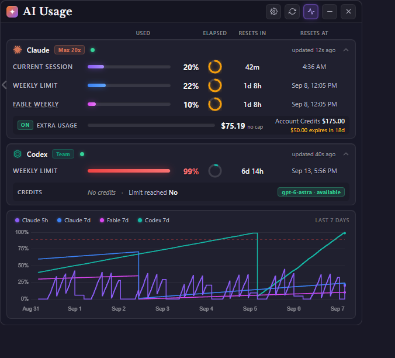
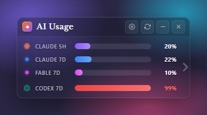
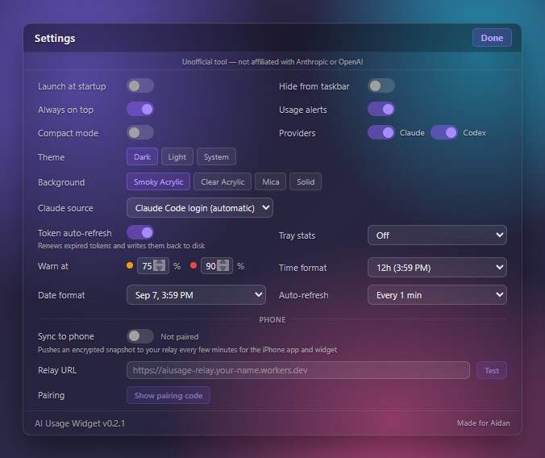
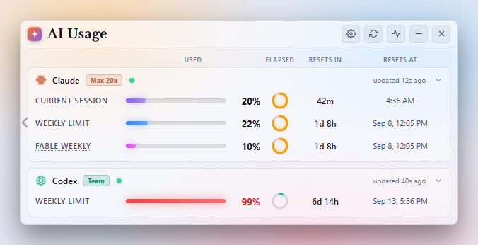
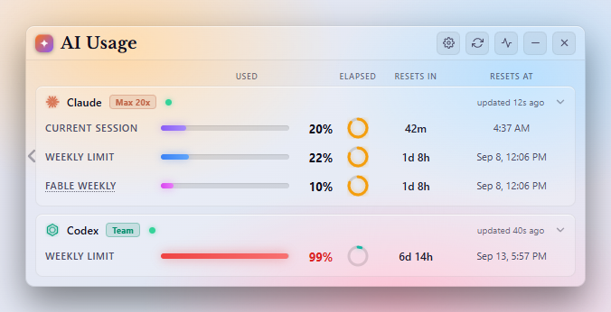

# AI Usage Widget

A small always-on-top desktop widget for **Windows and macOS** that shows how much of your **Claude** and **Codex** usage limits you have burned through, side by side, on a frosted-glass panel - plus an **iPhone companion app with a home-screen widget** that mirrors the same numbers. The desktop widget reads the sign-in files that Claude Code and the Codex CLI already keep on your machine, asks the same usage endpoints those tools use, and talks to nobody else (unless you turn on phone sync, which sends an encrypted copy to a relay you control).

It started as a fork of SlavomirDurej's [`claude-usage-widget`](https://github.com/SlavomirDurej/claude-usage-widget) and grew a second provider, a Fable weekly bar, Windows 11 / macOS backdrops, a much more careful token-handling story, and the phone widget.

[](https://github.com/Aidanfl/ai-usage-widget/actions/workflows/ci.yml)
[](https://github.com/Aidanfl/ai-usage-widget/releases/latest)
[](LICENSE)



*(Screenshots are rendered with sample data. On a real desktop the panel is translucent - the two right-hand images show the glass.)*

| Compact mode (290 px) | Settings | Light theme (Smoky Acrylic) | Clear Acrylic |
|---|---|---|---|
|  |  |  |  |

## Download

Grab the latest build from the [**Releases** page](https://github.com/Aidanfl/ai-usage-widget/releases/latest):

| Platform | File | Notes |
|---|---|---|
| **Windows 10/11** | `AI-Usage-Widget-<version>-win-Setup.exe` | Installer: pick a folder, get Desktop + Start Menu shortcuts, "Launch at startup" works. |
| **Windows (no install)** | `AI-Usage-Widget-<version>-win-portable.exe` | Single file, runs from anywhere. |
| **macOS 12+** (Apple Silicon + Intel) | `AI-Usage-Widget-<version>-mac.dmg` | Universal build. Unsigned - see *Installing on macOS* below. |
| **iPhone (iOS 17+)** | build from [`ios/`](ios/README.md) | Companion app + home-screen widget. Not on the App Store (yet); needs Xcode or a free Apple ID sideload. |

The builds are not code-signed (no certificate), so **Windows SmartScreen** says "Windows protected your PC" the first time: click *More info* → *Run anyway*. **macOS Gatekeeper** needs the one-time step below. Every release is built from the tagged source by [GitHub Actions](.github/workflows/release.yml), so you can check what went into it.

### Installing on macOS

1. Open the `.dmg` and drag **AI Usage Widget** into *Applications*.
2. The first launch is blocked because the app is not notarised ("Apple could not verify..." or "is damaged and can't be opened"). Either open **System Settings → Privacy & Security**, scroll down and click **Open Anyway**, or clear the quarantine flag once from Terminal:
   ```sh
   xattr -dr com.apple.quarantine "/Applications/AI-Usage-Widget.app"
   ```
3. Launch it again. The panel appears with the macOS glass backdrop; the percentages can also live in the **menu bar** (Settings → Tray stats).

On macOS the widget is pinned to every Space and floats above full-screen apps, so "Always on top" really is always on top there.

## What it is

- **One panel, two providers.** A Claude card and a Codex card, each with one row per usage window the API reports. You can hide either provider in Settings.
- **Claude rows:** Current Session (the 5-hour window), Weekly Limit (7 days), and a separate **Fable Weekly** bar when your account has a model-scoped weekly limit. Other scoped or legacy per-model buckets (Opus, Sonnet, Cowork, OAuth Apps, Design) appear only when the API actually returns them.
- **Codex rows:** whatever windows your plan has, labelled by their length (5-Hour Limit, Weekly Limit, Daily, Monthly...), plus Code Review and any per-feature "additional" limits the API sends.
- **Details panels** (the chevron on each card): Claude's extra-usage spend and account credits; Codex's credit balance, "limit reached" flag and per-model availability.
- **A 7-day history graph**, a **compact mode**, **tray badges** with the percentages, and **desktop notifications** when a window crosses your warning or danger threshold.
- **Smoky Acrylic / Clear Acrylic / Mica / Solid backgrounds**, dark, light or system theme. Clear Acrylic is Windows' bright, untinted glass and always uses dark text.

**Platforms.** Windows is where the widget was built and is tested daily. The macOS build uses the same code with native vibrancy instead of DWM acrylic, a menu-bar item instead of tray badges, and Dock hiding instead of "hide from taskbar"; it is built and unit-tested on GitHub's macOS runners but has not been exercised by hand on a Mac, so please report anything odd. Linux is not packaged (it would run with the Solid background).

## Requirements

| What | Why |
|---|---|
| **Windows 11 22H2 or newer (build 22621+)**, or **macOS 12+** | Windows 11 22H2 is needed for the Smoky Acrylic, Clear Acrylic and Mica backdrops; on anything older the widget silently falls back to the Solid background (which still works). macOS gets the two glass backdrops through vibrancy (Mica is Windows-only and shows as Smoky there). |
| **Node.js 18 or newer** | Only to run from source or build. `package.json` says `>=18`; the widget was developed on Node 24. The unit tests (`npm test`) use a glob pattern that needs Node 21+. |
| **Claude Code signed in** | The default Claude source reads `%USERPROFILE%\.claude\.credentials.json`, which Claude Code writes when you log in. Run `claude` once and log in. (Alternative: the claude.ai browser login, see below.) |
| **Codex CLI signed in with ChatGPT** | The Codex card reads `%USERPROFILE%\.codex\auth.json`. Run `codex login` and pick the ChatGPT sign-in. API-key mode cannot see usage, and the card will say so. |

## Run from source

```sh
git clone https://github.com/Aidanfl/ai-usage-widget.git
cd ai-usage-widget
npm install
npm start
```

Useful variants:

- `npm run dev` - same, but opens DevTools detached from the widget.
- `npm start -- --debug-log` (or set `DEBUG_LOG=1`) - prints debug-level log lines (rate-limit decisions, credits fetches, renderer console) to the terminal.
- `npm test` - runs the unit tests for the pure modules (normalisation, token refresh, alerts, history, formatting, scheduler). No Electron needed.

Note: when running from source the "Launch at startup" toggle saves but does nothing to Windows. Registering `electron.exe` as a login item would launch a bare Electron window, so that path is skipped in dev.

## Build

```bat
npm run build:portable
```

produces `dist\AI-Usage-Widget-0.2.1-win-portable.exe` - a single file, no installer, runs from wherever you put it.

```bat
npm run build
```

runs `electron-builder --win`, which builds **both** targets configured in `package.json`: the NSIS installer `dist\AI-Usage-Widget-0.2.1-win-Setup.exe` (lets you choose the folder, adds desktop and Start Menu shortcuts) and the portable exe above.

```sh
npm run build:mac
```

on a Mac builds the universal `dist/AI-Usage-Widget-0.2.1-mac.dmg` (and a `.zip`). There is no Apple Developer certificate, so `build/after-pack.js` ad-hoc signs the bundle (Apple Silicon refuses to run unsigned code at all) and the DMG is not notarised.

`dist/` is ignored by git. The version number in the file names comes from `package.json`.

**Releases are built by CI.** Pushing a tag `vX.Y.Z` (matching `package.json`) runs [`.github/workflows/release.yml`](.github/workflows/release.yml): the Windows installer + portable exe are built on a Windows runner, the DMG on a macOS runner, and everything is attached to a GitHub Release with the matching CHANGELOG section as notes. [`ci.yml`](.github/workflows/ci.yml) runs the unit tests on Windows, macOS and Linux and compiles the iOS app for the Simulator on every push.

## Launch at startup

- **Installer build:** Settings -> *Launch at startup*. This registers the installed exe as a Windows login item (`app.setLoginItemSettings`).
- **Portable build:** the toggle is greyed out ("Not supported in portable mode"). Do it the Windows way instead: press `Win + R`, type `shell:startup`, press Enter, and drop a shortcut to `AI-Usage-Widget-0.2.1-win-portable.exe` into the folder that opens.
- **macOS:** the same toggle registers the app as a login item (System Settings → General → Login Items shows it).

Either way the widget is single-instance: launching it a second time just brings the existing window forward.

## How it reads your usage

Everything below happens in the Electron main process using Node's built-in `fetch`. The widget has **no server of its own**, sends nothing to third parties, and never logs or displays a token (even JSON parse errors have the file contents stripped out before they reach a log line).

### Claude via Claude Code credentials (default: "Claude Code login (automatic)")

- **File:** `%USERPROFILE%\.claude\.credentials.json` (or `%CLAUDE_CONFIG_DIR%\.credentials.json` if that variable is set), the `claudeAiOauth` object inside it. It is re-read on **every** refresh, because Claude Code rotates the tokens itself.
- **Endpoints, all on `https://api.anthropic.com`:**
  - `GET /api/oauth/usage` - the limits. Polled at most **once per 60 seconds** no matter what refresh interval you pick; a refresh inside that minute just re-shows the previous result.
  - `GET /api/oauth/profile` - at most once per hour per token. Gives the account name, a plan fallback, and the organisation id.
  - `GET /api/oauth/organizations/<org>/prepaid/credits` - at most every 5 minutes, and only while the Claude details panel is open (or on the very first fill). Gives the account-credits balance shown in the details panel.
- **Headers:** `Authorization: Bearer <token>`, `anthropic-beta: oauth-2025-04-20`, and a `User-Agent` of `claude-cli/<version> (external, cli)` - the same user agent Claude Code sends. The version is read once at startup by running `claude --version` (fallback `2.1.263`). This is deliberate: tokens used with an unfamiliar user agent get dropped into an aggressively rate-limited bucket. No API key is ever sent.
- **Plan chip** (Max 20x, Max 5x, Pro, ...) comes from `rateLimitTier` / `subscriptionType` in the credentials file.
- **Rate limits (HTTP 429):** the widget honours `Retry-After` when present, otherwise waits 5, then 10, 20, 30 minutes, never retrying inside 60 s. The card keeps the last good numbers with an amber dot and "Rate limited, retrying at hh:mm".

### Codex via the Codex CLI's auth file

- **File:** `%USERPROFILE%\.codex\auth.json` (or `%CODEX_HOME%\auth.json`). Needs `tokens.access_token`; the account id comes from `tokens.account_id` or, failing that, from inside the JWT. Re-read every refresh.
- **Endpoint:** `GET https://chatgpt.com/backend-api/wham/usage` with `Authorization: Bearer`, `ChatGPT-Account-Id`, and an honest `User-Agent: ai-usage-widget/0.1.1 (Windows)` (it does not pretend to be the Codex CLI). Polled at most **once per 30 seconds**; a refresh inside that window re-shows the previous result.
- If `auth_mode` is anything other than `chatgpt` (for example API-key mode) the card shows "Sign in to Codex with ChatGPT to see usage".
- **Rate limits (HTTP 429):** the card goes amber with "Codex rate-limited the usage request; retrying later" and sits out the next automatic cycle.

### Token auto-refresh: what it does, when it writes, how to turn it off

Both credential files hold a short-lived access token plus a refresh token. Normally Claude Code and the Codex CLI renew them for you while you work, and the widget just reads. The **Token auto-refresh** setting (on by default) lets the widget renew a token itself when the owning tool has not - typically because you have not used it for a while. When it does, **it writes the new tokens back to the credential file**, because refresh tokens are single-use: if the rotated token were not saved, the next Claude Code or Codex run would be forced to log in again.

**Claude - only after the token has actually lapsed, never ahead of time.** Claude Code refreshes about 4 minutes before expiry. A widget that refreshed early would race it and burn the single-use refresh token, so the widget only tries when:

1. `expiresAt` is at least 60 s in the past, **or** the usage request came back `401`; **and**
2. the file still holds the same refresh token the widget loaded (if Claude Code got there first, the widget uses Claude Code's new tokens and makes no request); **and**
3. the refresh token's own expiry (`refreshTokenExpiresAt`) has not passed; **and**
4. the widget has not attempted a refresh in the last 10 minutes; **and**
5. the file was not written in the last 30 s, and Claude Code's lock folder `.claude\.oauth_refresh.lock` is free (the widget waits up to about 7.5 s for it, and treats a lock older than 60 s as abandoned).

The request is `POST https://platform.claude.com/v1/oauth/token` (falling back to `console.anthropic.com` only on 404/405/5xx/network). On success the widget re-reads the file under the lock, replaces **only** `accessToken`, `refreshToken`, `expiresAt`, `refreshTokenExpiresAt` and `scopes`, keeps every other key untouched, and writes compact single-line JSON the way Claude Code does: to `.credentials.json.tmp.<8 hex>` first, then renames it over the original. If Windows refuses the rename because another program has the file open, it rewrites the file in place instead. It never writes in place on disk-full or I/O errors (that could truncate your credentials).

If the server rejects the refresh token (`invalid_grant`, 401, 403) the Claude card goes red and the widget makes no further attempts for 24 hours or until the credentials file changes. Network or 5xx errors retry after 60 s, then every 30 minutes.

**Codex - the same idea.** The Codex CLI and the Codex desktop app both renew the token up to 5 minutes before its JWT `exp`, and their refresh tokens rotate and are single-use too, so the widget again waits until the token has **actually lapsed by 60 s** or the usage request came back `401`. It then re-reads `auth.json` (if the CLI already rotated the token, the widget uses theirs and makes no request), and only proceeds when the file was not written in the last 30 s and the widget has not attempted a refresh in the last 10 minutes. The request is `POST https://auth.openai.com/oauth/token` with the Codex CLI's public client id. On success it re-reads the file once more, writes back `tokens.access_token`, `tokens.refresh_token`, `tokens.id_token` and `last_refresh`, keeps the file's existing indentation, and saves via a temp file plus rename. Permanent failures (`invalid_grant`, `refresh_token_expired/reused/invalidated`, 401, 403) show "Codex sign-in expired - run `codex login` to sign in again" and pause attempts for 30 minutes or until `auth.json` changes (so `codex login` recovers immediately); transient ones back off 1, 2, 4... up to 30 minutes.

**To turn it off:** Settings -> *Token auto-refresh*. With it off the widget never writes to either file. An expired token then shows a red dot with "Claude token expired - enable token auto-refresh or run claude to sign in again" (or the Codex equivalent); running `claude` or `codex` once refreshes the file and the widget picks it up on its next poll.

### Alternative: claude.ai browser login

If you would rather not have the widget touch Claude Code's file at all, switch Settings -> *Claude source* to **claude.ai browser login** and press *Log in*. A login window opens at `claude.ai/login` (navigation is restricted to claude.ai, anthropic.com and the Google / Apple / Microsoft sign-in pages). As soon as claude.ai sets its `sessionKey` cookie the window closes. The key is encrypted with Windows' per-user credential encryption (Electron `safeStorage`) and stored in `config.json` under `claudeWebSession`; it is never handed to the UI layer.

Usage then comes from `https://claude.ai/api/organizations/<org>/usage`, fetched through a hidden browser window (plain requests get blocked by Cloudflare). The spend endpoints `/overage_spend_limit` and `/prepaid/credits` are only fetched while the Claude details panel is open. If you belong to two or more chat-capable organisations a dropdown appears to pick one (team organisations are preferred by default). *Log out* clears the cookie, the stored key and the cached storage. A dead session shows "claude.ai session expired - log in again in Settings". There is no token refresh in this mode and nothing is ever written to `~/.claude`.

## Understanding the display

### Anatomy

- **Title bar:** "AI Usage", then buttons for Settings, Refresh (spins while a fetch is in flight), Graph (highlighted when open), Minimise and Close. Drag the bar to move the widget.
- **Column headers**, shown once at the top: **USED** (bar + percent), **ELAPSED** (ring), **RESETS IN**, **RESETS AT**. Session rows show a time in *resets at* (`3:59 PM`); weekly rows - Claude's Weekly Limit, Fable Weekly, Codex's Weekly Limit - show the date **and** the time (`Sep 7, 3:59 PM`), because a bare date never said when in the day the week rolls over.
- **Provider card header:** logo, name, plan chip (Max 20x, Pro, Team, Plus...), status dot, "updated Ns ago", and a chevron when there are details to show.
- **Left-edge chevron** switches to compact mode; in compact mode the right-edge chevron switches back.

### Rows and colours

Each row is one usage window. The bar and percent use the window's own colour until you get close to the limit:

| Row | Colour |
|---|---|
| Claude Current Session (5 h) | purple |
| Claude Weekly Limit (7 d) | blue |
| Fable Weekly | fuchsia |
| Other Claude scoped / legacy weekly rows | rose, amber, slate (rotating) |
| Codex 5-Hour Limit | green |
| Codex Weekly Limit | teal |
| Codex Daily / Monthly / Code Review | slate |
| Codex "additional" limits | amber, rose, slate (rotating) |

- **Amber** at or above the *Warn at* threshold (default 75%), **red** at or above the *Danger* threshold (default 90%). Red also when Codex reports the limit as reached / not allowed, whatever the percent says.
- Percent over 100 is drawn as a full bar labelled 100%; hovering the percent shows the real figure with "(over limit)".
- **Elapsed ring:** how far through the 5-hour or 7-day window you are, in the row's colour. It turns **amber at 75% elapsed and green at 90% elapsed** - green meaning "the reset is close". These two ring thresholds are fixed and unrelated to the usage thresholds. Hover for the exact figure. The ring is hidden when the API did not say how long the window is.
- **Resets In:** "43m", "4h 12m", "1d 8h". "Not started" when usage is 0% and there is no reset time yet (hover: "Starts when a message is sent"). "Resetting..." once the reset time has passed; the widget then refetches automatically about 3 s later.
- **Resets At:** session-style rows show a time (12h or 24h), weekly-style rows use your date format. Hover for the full date and time.
- **Status dot:** green = up to date; amber = the last refresh failed or the data is more than 2 minutes old, and the numbers shown are the last good ones (hover for the reason); red = sign-in needed or an error. A red card also shows the message in full with a *Retry* button (or *Sign in* for the claude.ai source) and a one-line hint.

### The Fable Weekly bar and the 50% share

Fable's weekly row is a *scoped* limit: the API reports its percent **relative to Fable's own allotment, which is 50% of your weekly pool**, not relative to the whole weekly limit. So "Fable Weekly 10%" means you have used a tenth of the half of your weekly budget that is set aside for Fable - about 5% of the total. The row label carries a faint dotted underline as a hint; hover it and the tooltip says "Percent of Fable's 50% share of the weekly limit".

### Codex windows depend on your plan

Codex rows are labelled by how long the window is (matched within 5% of 5 hours, 1 day, 7 days, 30 days or 1 year; anything else becomes "N-Hour Limit"). Some plans report only a weekly window, others a 5-hour and a weekly window; the widget shows exactly what the API returns and never invents a row. The Team account in the screenshots has just the weekly window.

### Details panels (the chevron)

- **Claude -> Extra Usage:** an ON/OFF pill (hover the OFF pill to see why), a monthly spend bar showing `$spent / $cap` (or "no cap"), and on the right **Account Credits** with the prepaid balance. Hover the balance for the promo / paid split. An expiry chip such as "$50.00 expires in 18d" turns amber within 21 days and red within 7 days; further out it shows the date. This row only appears when the API reports spend or credit data.
- **Codex -> Credits:** *Unlimited*, "*N* credits", *Available* or *No credits* (hover for approximate local/cloud message counts, reset credits and the overage flag), a **Limit reached Yes/No** indicator (hover for the reason type), and up to three model chips showing "available" or "until 3:59 PM", with a "+N" chip for the rest.

### Graph

The graph button opens a 7-day history: one stepped line per row in that row's colour, a dashed line at your danger threshold, y-axis 0-100%. Click a legend item to hide or show that series; hover for the time and values. A sample is stored after every successful refresh (stale, error and signed-out states add nothing, so gaps are honest gaps). It says "No history yet" until a few samples exist. The graph is hidden in compact mode.

### Compact mode

A 290 px strip with one thin bar per window - "CLAUDE 5H", "CLAUDE 7D", "FABLE 7D", "CODEX 7D" - and the percent. Same colours and thresholds. Hover a bar for its reset countdown. Opening Settings temporarily switches to the wide layout and switches back when you press Done.

### Backgrounds

Windows fixes how strong the acrylic blur is; what the widget controls is the base colour of the glass (through the theme the window is created under) and the tint it paints on top.

- **Smoky Acrylic** (default) - dark grey glass with a light smoky tint (`rgba(24,22,40,0.30)` over the panel, a slightly darker title band). The base stays dark even when Windows is in light mode. Works with the Dark and Light themes; Light adds its own milky tint.
- **Clear Acrylic** - the same material created under the light Windows theme: bright, milky, clearly see-through, with **no tint at all**. Because white text is unreadable on it, Clear Acrylic always uses the dark-text palette whatever the Theme setting says (Settings shows "Clear Acrylic uses dark text"). Bars and rings keep their colours.
- **Mica** - Windows' wallpaper-tinted opaque backdrop, with the heavier tint the widget shipped with.
- **Solid** - a plain gradient panel with its own rounded corners; the only option before Windows 11 22H2.

Switching backgrounds recreates the window in place (the material and the window theme are fixed at creation time), so the panel blinks once.

On **macOS** the same two glass looks come from NSVisualEffectView vibrancy (`under-window`, kept active even when the widget is not the key window): Smoky pins the dark appearance, Clear the light one. Mica does not exist there and is treated as Smoky.

### Notifications

With *Usage alerts* on, you get a Windows toast when a window first crosses the warning threshold, first crosses the danger threshold, becomes blocked (100% or Codex "limit reached"), and once more when a blocked provider becomes usable again. Each fires at most once per reset cycle, and the very first check after launch is silent so you are not toasted about a state you are already looking at. Codex blocks are grouped into one toast even when several windows lock at once.

## Settings reference

Every key stored under `settings` in `config.json`, with its default (from `SETTINGS_DEFAULTS` in `src/main/store.js`) and what it does. Invalid values are replaced with the previous good value or the default, so hand-editing the file is safe-ish.

| Key | In the UI | Default | What it means |
|---|---|---|---|
| `autoStart` | Launch at startup | `false` | Register the installed app as a Windows / macOS login item. Greyed out in the portable build; has no effect when running from source. |
| `hideFromTaskbar` | Hide from taskbar / Dock | `false` | Removes the taskbar button (Windows) or the Dock icon (macOS); Minimise then hides to the tray / menu bar instead. Turning it on with tray stats off forces `trayStats` to `both`; turning tray stats off turns this back off. (Otherwise there would be no way to get the window back.) |
| `alwaysOnTop` | Always on top | `true` | Float above other windows. On Windows it is re-asserted every 2 s (see Troubleshooting for the full-screen-game case); on macOS the window is also shown on every Space and over full-screen apps. |
| `theme` | Theme | `'dark'` | `dark`, `light`, or `system` (follows Windows). |
| `background` | Background | `'acrylic'` | `acrylic` (**Smoky Acrylic** - the name changed in 0.1.1, the stored value did not), `acrylic_clear` (**Clear Acrylic**), `mica`, or `solid`. Changing it recreates the window at the same position (Electron cannot switch backdrops live, and the two acrylics differ in the window theme they are created under). Clear Acrylic always renders with the dark-text palette regardless of `theme`. All three materials are forced to `solid` on Windows builds older than 22621. |
| `warnThreshold` | Warn at (amber dot) | `75` | Percent at which bars, badges and alerts go amber. 1-99. |
| `dangerThreshold` | Warn at (red dot) | `90` | Percent at which they go red. 1-99 and must be above warn; the UI refuses to save otherwise, and the store swaps them if they arrive reversed. |
| `timeFormat` | Time format | `'12h'` | `12h` (3:59 PM) or `24h` (15:59). |
| `dateFormat` | Date format | `'date'` | Whether the weekday is shown in a weekly row's *resets at* cell: `date` (Sep 7, 3:59 PM) or `date-day` (Sun Sep 7, 3:59 PM). The time is always shown. Configs from 0.2.1 or earlier that say `date-day-time` are migrated to `date-day`. |
| `usageAlerts` | Usage alerts | `true` | Desktop notifications on/off. |
| `compactMode` | Compact mode | `false` | The 290 px view. Also toggled by the edge chevrons. |
| `refreshInterval` | Auto-refresh | `'120'` | Seconds between polls, as a string: `'15'`, `'30'`, `'60'`, `'120'`, `'300'`. Independently of this, the Claude usage endpoint is never hit more than once per 60 s and the Codex one more than once per 30 s. |
| `graphVisible` | Graph button | `false` | Remembers whether the history graph is open. |
| `expandedOpen` | Card chevrons | `{ claude: false, codex: false }` | Remembers each details panel. Also decides whether the Claude credits / spend endpoints are polled. |
| `providers` | Providers | `{ claude: true, codex: true }` | Show or hide each provider. A hidden provider is not polled at all. |
| `claudeSource` | Claude source | `'claude_code'` | `claude_code` (credentials file) or `claude_web` (claude.ai browser login). |
| `tokenAutoRefresh` | Token auto-refresh | `true` | Allow the widget to renew expired tokens and write them back to disk. See above. |
| `trayStats` | Tray stats | `'off'` | `off`, `claude`, `codex`, or `both`. See "Tray badges" (menu-bar text on macOS). |
| `phoneSyncEnabled` | Phone → Sync to phone | `false` | Push an encrypted copy of every snapshot to the relay so the iPhone widget can show it. See "Phone widget". |
| `phoneRelayUrl` | Phone → Relay URL | `''` | The `https://` base URL of your relay (`relay/`). |
| `windowPosition` | (drag the window) | `null` | `{ x, y }`, saved about 300 ms after you stop dragging. Ignored and re-centred if it is off every display. |
| `claudeOrganizationId` | Claude organisation dropdown | `null` | Only used by the claude.ai source. |

`config.json` also holds `claudeWebSession` (the encrypted claude.ai key, only if you used the browser login) and `phonePairKey` (the encrypted phone-pairing key). Settings changes are applied live; the file is written on every change.

## Tray badges

Off by default. Set *Tray stats* to:

- **Claude** - two 20 x 20 badges: Weekly (blue) and Session (purple).
- **Codex** - one badge per Codex window: Weekly (teal) and 5-Hour (green), only for windows your plan has.
- **Both** - the Codex badges, then the Claude badges.

Each badge shows the rounded percent in a bitmap font (ported from the original widget), recoloured amber or red at your thresholds, and replaced by a red **X** at 99% or more. Before the first data arrives, or when a slot has no window, you see a grey dash. Hover for a tooltip like `Claude Weekly: 22%` / `Resets: Sep 7, 1:59 PM` (session badges show just the time); a stale provider adds "(last refresh failed - showing previous values)".

Left-click any badge to show or hide the widget (this also rescues a window that has drifted off-screen). Right-click for **Show Widget**, **Refresh**, **Exit**. While badges exist, the title-bar Close button *hides* the widget instead of quitting; use **Exit** in the tray menu to quit. With tray stats off, Close quits.

**macOS** has no coloured badges: the same setting puts one monochrome menu-bar item up with the percentages as text - `91% · 42%` (weekly · session) for a single provider, `Codex 3%·1%  Claude 91%·42%` for both, `✕` at 99%+ and `–` while a slot has no data. Hover for the per-window tooltip; click for **Show Widget**, **Refresh**, **Quit AI Usage Widget**.

## Phone widget (iPhone)

The `ios/` folder holds a native SwiftUI companion app with **home-screen widgets** (small, medium, large) and **lock-screen widgets** that show the same rows as the desktop: Claude session / weekly / Fable, Codex windows, resets, freshness - plus the details panels and the 7-day chart inside the app.

The phone never signs in to Anthropic or OpenAI. Instead the **desktop widget pushes an encrypted copy of each snapshot to a relay you host** (a tiny Cloudflare Worker in [`relay/`](relay/README.md), free tier is plenty for personal use), and the phone pulls and decrypts it. The key travels inside a QR code between your two devices and never reaches the relay, which only ever stores ciphertext. The protocol is written up in [`docs/PHONE-SYNC.md`](docs/PHONE-SYNC.md).

Setup, once:

1. Deploy the relay: `cd relay && npx wrangler login && npx wrangler kv namespace create SLOTS` (paste the id into `wrangler.toml`) `&& npx wrangler deploy`. You get a `https://aiusage-relay.<you>.workers.dev` URL.
2. Desktop widget → Settings → **Phone**: paste the relay URL, press *Test*, turn on **Sync to phone**, then **Show pairing code**.
3. Build the iOS app from `ios/` with Xcode (see [`ios/README.md`](ios/README.md)), open it on your iPhone and scan the code (or paste the `aiusage://pair?...` string). Add the **AI Usage** widget to your home screen.

The desktop pushes at most once a minute and otherwise every five minutes or whenever a percentage changes; the widget refreshes on iOS's schedule (roughly every 15 minutes) and shows how old the numbers are. If the desktop is off, the phone keeps showing the last snapshot with its age.

Why not a standalone phone app? See the top of `docs/PHONE-SYNC.md`: it would have to sign in to Claude and ChatGPT with another product's OAuth client, which is against both providers' terms and a rejection risk at App Review, so the phone stays a display for data your desktop already has.

## Troubleshooting

**Always on top stops working while a game is fullscreen.** Windows refuses "always on top" to every app (not just this one) while a fullscreen game is the active window, so a widget started or restarted during a game comes up behind other windows. While the flag is denied, the widget still raises itself above the other ordinary windows on its monitor every 2 seconds (without taking focus), and it gets the real flag back the first moment the game is not in front (alt-tab out for a second, or click any other window); after that it stays on top, including over borderless-windowed games. Turning on **Launch at startup** avoids the problem entirely, because the widget then already has the flag before any game starts. A game in exclusive fullscreen mode always covers everything; switch it to borderless/windowed if you want the widget visible over it.

**Red dot on Claude: "Claude Code sign-in expired - run claude to sign in again", "Log in to Claude Code (run `claude`) to see usage", or "Cannot read Claude credentials".**
Open a terminal and run `claude` (any command will do; use `/login` if it asks). Claude Code rewrites `.credentials.json`, and the widget picks it up on its next poll - or press Refresh.

**"Claude token lacks the user:profile scope (setup-token credentials cannot read usage)".**
The file was written by `claude setup-token`, which produces a token that cannot read usage. Run `claude` and log in normally. The widget stops retrying until the file changes.

**Amber dot: "Claude token expired - waiting for Claude Code to refresh it (...)".**
The widget is deliberately standing back: it attempted a refresh less than 10 minutes ago, the file was written seconds ago, or Claude Code holds the refresh lock. Run any Claude Code command to refresh the token, or just wait - the numbers shown are the last good ones.

**Red dot on Codex: "Sign in to Codex with ChatGPT to see usage", "Codex sign-in expired - run `codex login` to sign in again", or "Codex rejected the token - sign in with `codex login`".**
Run `codex login` and choose the ChatGPT sign-in. If `auth.json` says `auth_mode: apikey`, usage cannot be read at all. A fresh `auth.json` releases any refresh back-off straight away.

**Amber dot: "Codex token expired - waiting for Codex to refresh it (...)".**
Same story as the Claude one: the widget attempted a refresh less than 10 minutes ago or `auth.json` was written seconds ago. Run any `codex` command, or wait.

**Amber dot: "Rate limited, retrying at hh:mm".**
Claude answered 429. The widget waits (Retry-After if given, otherwise 5, 10, 20, 30 minutes) and keeps showing the last good values. Picking a shorter refresh interval does not help - Claude is polled at most once a minute regardless (Codex at most every 30 s). The Codex version reads "Codex rate-limited the usage request; retrying later" and skips one cycle.

**Background is stuck on Solid and Smoky Acrylic / Clear Acrylic / Mica are greyed out.**
All three materials need Windows 11 22H2 (build 22621) or newer; Settings shows "Acrylic and Mica need Windows 11 (22H2+)". On older Windows the widget forces Solid at startup.

**Clear Acrylic ignores my Dark theme.**
By design: Clear Acrylic sits on Windows' light glass, where white text is unreadable, so it always uses the dark-text palette (Settings says "Clear Acrylic uses dark text"). Pick Smoky Acrylic for a dark panel.

**macOS says the app "is damaged and can't be opened" or "Apple could not verify".**
The build is not notarised. Use *System Settings → Privacy & Security → Open Anyway*, or run `xattr -dr com.apple.quarantine "/Applications/AI-Usage-Widget.app"` once. See *Installing on macOS*.

**Phone: "Desktop hasn't pushed yet" / the widget never updates.**
Check the desktop's Settings → Phone status line: it says when the last push succeeded or why it failed (wrong relay URL, relay returned 401 after a re-pair on one side only, network). After a **Re-pair** on the desktop the phone must scan the new code - the old key is gone. The relay keeps a slot for 7 days after the last push.

**The widget has vanished / is off-screen.**
If you have tray badges, left-click one. Otherwise launch the app again - it is single-instance, so the second launch just shows the existing window and re-centres it if it is off every display. As a last resort quit the widget and set `"windowPosition": null` in `config.json`.

**Everything is amber after the PC wakes from sleep.**
The widget refreshes on resume; give it a few seconds or press Refresh.

**Both cards are gone and it says "Both providers are turned off".**
Open Settings and turn a provider back on.

**Where things live.** Settings and the encrypted claude.ai / phone-pairing keys: `%APPDATA%\ai-usage-widget\config.json` on Windows, `~/Library/Application Support/ai-usage-widget/config.json` on macOS. Graph samples: `usage-history.json` next to it (kept for 8 days, at most 10,000 samples). Quit the widget, delete either file, and it starts fresh. The only other files the widget ever writes are the two credential files described under "Token auto-refresh", and only when that setting is on and a token has actually expired.

**Getting logs.** Run from source with `npm start -- --debug-log` (or `DEBUG_LOG=1`) to see refresh, rate-limit and token decisions in the terminal; `npm run dev` also opens DevTools. Tokens never appear in logs.

**`npm test` says it found no tests.** The test script uses a glob (`tests/**/*.test.js`) that Node only expands from version 21. The app itself runs on Node 18+, but run the tests on Node 21 or newer.

## Credits

**Original author: [Slavomir Durej](https://github.com/SlavomirDurej).** This project is a derivative work of his [claude-usage-widget](https://github.com/SlavomirDurej/claude-usage-widget) (MIT, Copyright (c) 2024 Slavomir Durej), which set the look and feel, the tray bitmap font, the alert rules and the claude.ai login flow. His licence is kept verbatim in [`LICENSE-claude-usage-widget`](LICENSE-claude-usage-widget) and referenced from [`LICENSE`](LICENSE). If you like this widget, go star the original.

This project is MIT-licensed (see [`LICENSE`](LICENSE)). Built with Electron, electron-builder, electron-store, Chart.js with `chartjs-adapter-date-fns`, date-fns and `qrcode`; the relay runs on Cloudflare Workers; the iPhone app is SwiftUI + WidgetKit + Swift Charts + CryptoKit. The title uses the Libre Baskerville typeface.

## Disclaimer

This is an unofficial hobby tool. It is not made by, affiliated with, or endorsed by Anthropic or OpenAI. It talks to the same private usage endpoints that Claude Code and the Codex CLI use, which are undocumented and may change or stop working without notice. It reads your local sign-in files and, when token auto-refresh is on and a token has expired, writes renewed tokens back to them exactly as described above. Use it at your own risk, and turn auto-refresh off if you would rather it never wrote anything.
